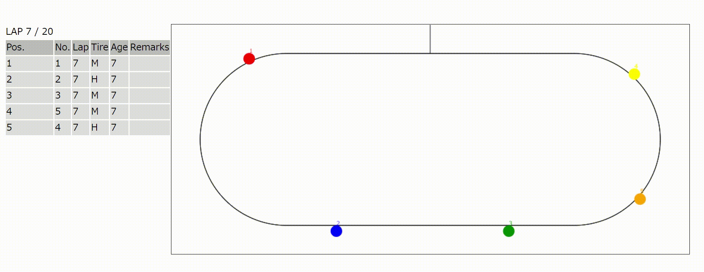

# race-strategy-sim

-   Simulation for race strategy

-   Tire strategy

    -   e.g. medium tire for 10 laps

-   Traffic feature

    -   Forerunner can block following car

-   Pit stop

    -   Change tire with time loss

## Requirements

-   _Make_

-   _CMake_ 3.22+

-   C++ compiler

## Usage

1.  Edit params  in  _src/config.hpp_

2.  Change settings in _settings.json_

    e.g.

    ```json
    "course_length": 10,

    "pit_time_loss": 1,

    "num_of_laps": 20,

    "car_data": [

        {
            "car_num": 1,
            "speed": 3.0,
            "tire_strategy": [

                {
                    "compound": "medium",
                    "lap": 10
                },
                {
                    "compound": "hard",
                    "lap": 21
                }
            ]
        }
    ]
    ```

    -   Prop `compound` expects `"soft" | "medium" | "hard"`

3.  Run simulation by `$ make`, and _out.json_ would be exported

4.  See the result
    1.  Open _index.html_ in browser
    2.  Pick _out.json_ file
    3.  Click [start]
    4.  And...


